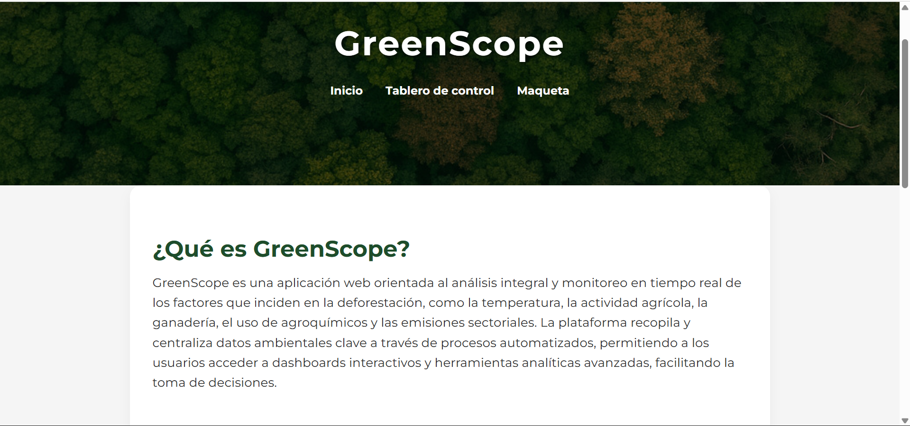
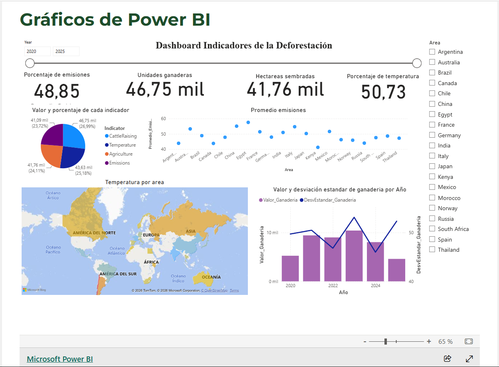
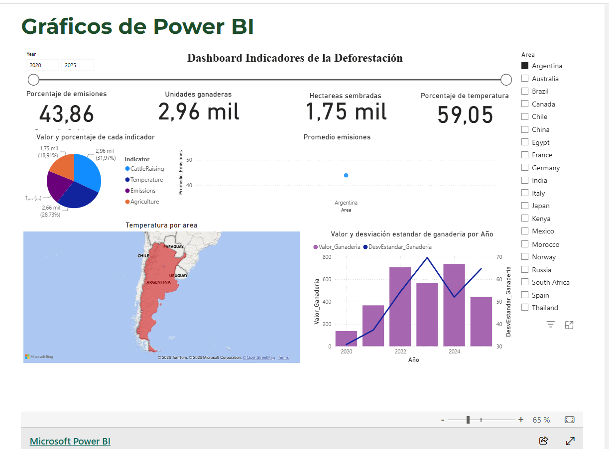
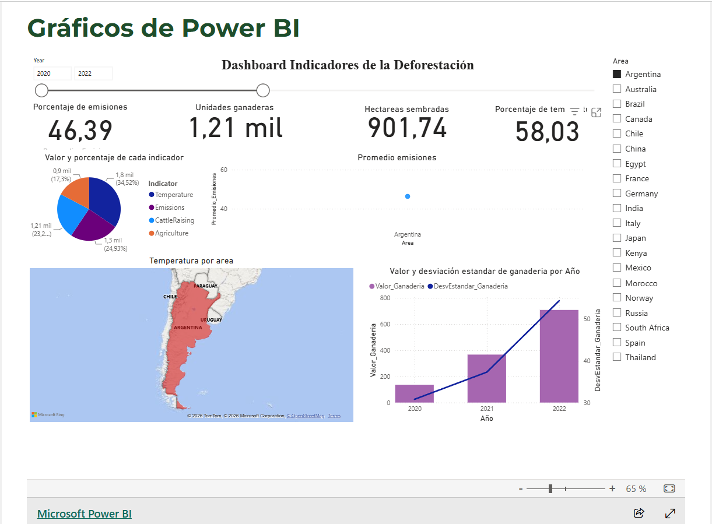
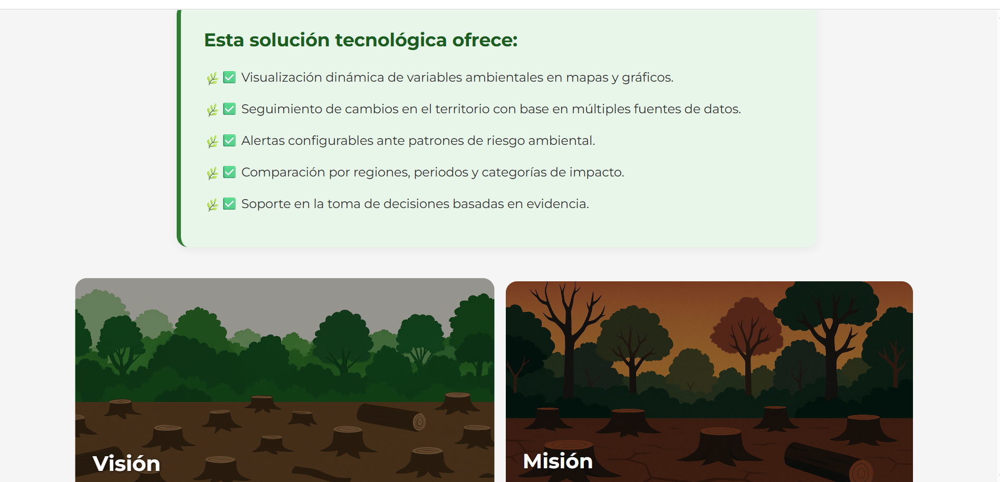

# GreenScope Platform

GreenScope is a web platform focused on environmental monitoring and the analysis of factors associated with deforestation. The platform centralizes environmental data and provides interactive dashboards to support data-driven decision making.

The system analyzes variables such as temperature, agricultural activity, livestock production, agrochemical usage and sector emissions through visual analytical tools.

---

## Features

* Environmental monitoring
* Interactive dashboards
* Deforestation analysis
* Data centralization
* Real-time visualization
* Analytical reports

---

## Technologies Used

### Frontend

* HTML
* CSS
* JavaScript

### Data Visualization

* Power BI

### Deployment

* Vercel

### Version Control

* Git
* Git LFS

---

## Main Objectives

* Analyze environmental factors related to deforestation
* Facilitate interpretation of environmental data
* Support decision making through visual analytics
* Improve accessibility to environmental information

---

## My Contributions

* Frontend development
* Dashboard integration
* Environmental data visualization
* Collaborative project development

---

## Screenshots

### Inicio de la página
Vista principal de la plataforma GreenScope, mostrando la interfaz inicial orientada al análisis de datos ambientales relacionados con la deforestación.



---

### Dashboard General
Panel principal con visualización general de métricas, gráficos y análisis relacionados con datos ambientales y deforestación.



---

### KPI 1 - Filtro por país
Visualización de indicadores clave aplicando filtros específicos por país para analizar datos ambientales de manera más detallada.



---

### KPI 2 - Filtro por país y año
Análisis de indicadores aplicando filtros por país y año para comparar el comportamiento de la deforestación en distintos periodos.



---

### Descripción del proyecto
Sección informativa que presenta la misión y visión de GreenScope, enfocada en el análisis ambiental y la concientización sobre la deforestación mediante herramientas tecnológicas y visualización de datos.



---

## Live Demo

https://green-scope-seven.vercel.app/

---

## Repository Structure

```bash id="3ck0rg"
src/
assets/
dashboard/
README.md
```

---

## Author

Kevin Alexander Tibaquicha Ortiz
Engineering Systems and Computing Student
